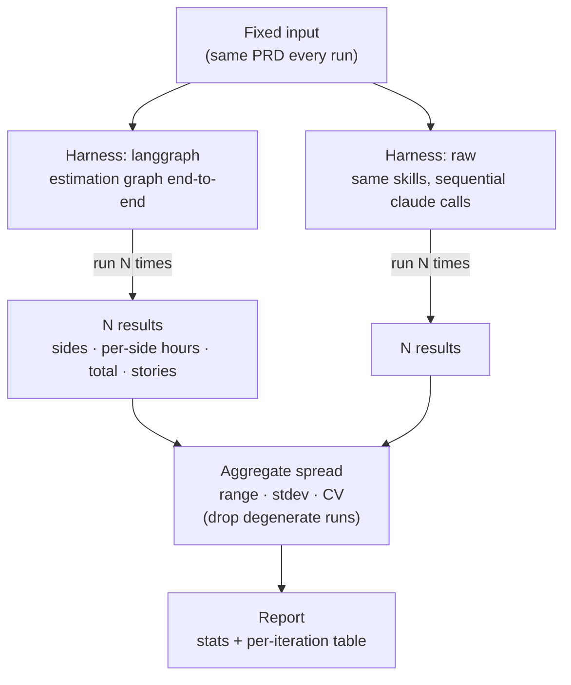

# Estimation determinism report

- iterations per input: **5**
- mode: **REAL (live LLM)**
- headline metric: coefficient of variation (CV = stdev / mean) of the grand total

## Methodology

To gauge how deterministic the estimate is, each fixed input is run through a harness N times and the spread of the results is measured — the same input, so any variation comes from the model, not the prompt. Two harnesses are compared on identical inputs: **langgraph** runs the estimation graph end-to-end, and **raw** replays the same skills as plain sequential `claude` calls (no graph). Per run we record each side's hours, the grand total, the selected sides, and the story count; across runs we report range, standard deviation, and CV (stdev/mean — unitless, so it compares across sides and harnesses). The risk buffer is applied identically in both, so it never contributes to the delta. A run that produced no parseable stories (total 0) is a degenerate result, not an estimate, and is excluded from the statistics but shown in the per-iteration table. CV bands: 0 deterministic · <5% highly stable · 5–15% moderate · 15–30% variable · >30% highly variable.

## Harness: `langgraph`

### Input: `offline_workouts` · 1 run error(s)

**Grand total (hours):** mean 162.7, range 126.5–187.4 (Δ 60.9), stdev 29.104, **CV 0.1789 → variable (15-30% CV)**

| side | mean | min | max | Δ range | stdev | CV | verdict |
|---|---|---|---|---|---|---|---|
| backend | 51.0 | 42.0 | 56.0 | 14.0 | 6.218 | 0.1219 | moderately stable (5-15% CV) |
| frontend | 14.75 | 0.0 | 31.0 | 31.0 | 17.076 | 1.1577 | highly variable (>30% CV) |
| qa | 75.75 | 68.0 | 80.0 | 12.0 | 5.439 | 0.0718 | moderately stable (5-15% CV) |
| devops | 0.0 | 0.0 | 0.0 | 0.0 | 0.0 | 0.0 | deterministic (0% CV) |

- side-selection stability: **1 distinct set(s)** — {'backend,frontend,qa': 4}
- stories/run: mean 7.75, range 7.0–9.0

**Per-iteration results (hours)** — `ok` rows are the 4 valid samples the stats above use; `excluded` = degenerate run: story_planner returned no parseable stories (the story-planner-hitl output-contract mismatch), so total 0. Recurs even on a sequential retry, so it is a reliability finding, not just a rate-limit artifact. Not counted in the stats:

| # | status | sides | stories | backend | frontend | qa | devops | total |
|---|---|---|---|---|---|---|---|---|
| 1 | ok | backend,frontend,qa | 7 | 54 | 28 | 79 | – | 185.1 |
| 2 | ok | backend,frontend,qa | 9 | 42 | 0 | 68 | – | 126.5 |
| 3 | ok | backend,frontend,qa | 8 | 52 | 0 | 80 | – | 151.8 |
| 4 | ok | backend,frontend,qa | 7 | 56 | 31 | 76 | – | 187.4 |
| 5 | excluded | backend,frontend,qa | 0 | 0 | 0 | 0 | – | 0.0 |

## Harness: `raw`

### Input: `offline_workouts`

**Grand total (hours):** mean 153.86, range 81.6–209.3 (Δ 127.7), stdev 45.864, **CV 0.2981 → variable (15-30% CV)**

| side | mean | min | max | Δ range | stdev | CV | verdict |
|---|---|---|---|---|---|---|---|
| backend | 29.6 | 0.0 | 54.0 | 54.0 | 27.619 | 0.9331 | highly variable (>30% CV) |
| frontend | 22.2 | 0.0 | 71.0 | 71.0 | 32.314 | 1.4556 | highly variable (>30% CV) |
| qa | 82.0 | 71.0 | 96.0 | 25.0 | 10.932 | 0.1333 | moderately stable (5-15% CV) |
| devops | 0.0 | 0.0 | 0.0 | 0.0 | 0.0 | 0.0 | deterministic (0% CV) |

- side-selection stability: **1 distinct set(s)** — {'backend,frontend,qa': 5}
- stories/run: mean 8.0, range 8.0–8.0

**Per-iteration results (hours)** — `ok` rows are the 5 valid samples the stats above use; `excluded` = degenerate run: story_planner returned no parseable stories (the story-planner-hitl output-contract mismatch), so total 0. Recurs even on a sequential retry, so it is a reliability finding, not just a rate-limit artifact. Not counted in the stats:

| # | status | sides | stories | backend | frontend | qa | devops | total |
|---|---|---|---|---|---|---|---|---|
| 1 | ok | backend,frontend,qa | 8 | 54 | 0 | 88 | 0 | 163.3 |
| 2 | ok | backend,frontend,qa | 8 | 0 | 40 | 96 | 0 | 156.4 |
| 3 | ok | backend,frontend,qa | 8 | 54 | 0 | 84 | 0 | 158.7 |
| 4 | ok | backend,frontend,qa | 8 | 0 | 0 | 71 | 0 | 81.6 |
| 5 | ok | backend,frontend,qa | 8 | 40 | 71 | 71 | 0 | 209.3 |
